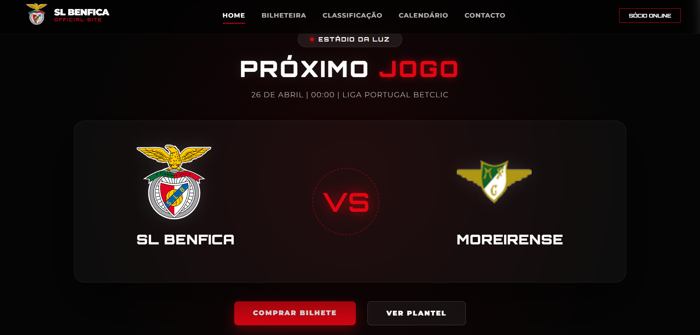

# 🦅 SLB Fan Hub | Full-Stack SPA Ecosystem

[](https://vuejs.org/)
[](https://flask.palletsprojects.com/)
[](https://www.sqlite.org/)
[](LICENSE)

# 🖼️ Preview


## 📝 Sobre o Projeto
Este projeto é uma **Single Page Application (SPA)** integral e robusta, desenvolvida para centralizar o ecossistema digital de um adepto de futebol. A aplicação combina uma interface reativa em Vue.js com um servidor Flask em Python, garantindo fluidez total na navegação sem recarregamentos de página.

## 🚀 Estrutura e Funcionalidades

### 🏠 Homepage & Navegação SPA
* **Arquitetura Reativa:** Toda a plataforma (Home, Bilheteira, Classificação, Calendário, Plantel e Sócio) funciona como uma SPA, onde os componentes são trocados dinamicamente via Vue Router para uma experiência instantânea.
* **Interface Premium:** Design escuro (Dark Mode) focado na identidade visual do clube, com destaque para o "Próximo Jogo" e acessibilidade mobile.

### ⚽ Módulos de Dados Desportivos
* **Classificação Dinâmica:** Dashboard interativo com dados da Liga Portugal. Implementação de *horizontal scroll* em dispositivos móveis para manter a integridade visual das estatísticas.
* **Match Center & Plantel:** Visualização organizada do calendário de jogos e listagem detalhada de todos os jogadores da equipa principal.

### 💳 Gestão de Sócios & Backend
* **Portal de Adesão:** Sistema de registo de novos sócios ligado diretamente ao servidor Flask com persistência em **SQLite3**.
* **Geração de Cartão Digital:** Motor de síntese de imagem (através de `cartaosocio.py`) que cria cartões personalizados em alta resolução para download ou partilha.
* **Formulário de Contacto:** Sistema de suporte integrado via **SMTP** (`enviarform.py`), integrado com **Mailtrap** para a captura e validação de emails em ambiente de desenvolvimento, garantido que as mensagens chegam ao destino com segurança.

---

## 📂 Estrutura do Projeto

```text
SANTO ANTONIO/
├── api/                        # Backend (Python & Flask)
│   ├── app.py                  # Servidor Principal e Rotas da API
│   ├── database.py             # Configuração e Conexão SQLite3
│   ├── cartaosocio.py          # Lógica de Geração do Cartão de Sócio
│   ├── enviarform.py           # Serviço de Email (SMTP)
│   └── .env                    # Variáveis de Ambiente
├── src/                        # Frontend (Vue.js 3 + Vite)
│   ├── assets/                 # Recursos Estáticos (Logos e Imagens)
│   ├── components/             # Componentes Globais (Navbar, Footer, Modais)
│   ├── router/                 # Configuração de Rotas SPA (index.js)
│   ├── views/                  # Páginas da Aplicação (Home, Classificação, etc.)
│   ├── App.vue                 # Componente Raiz
│   └── main.js                 # Ponto de Entrada do Vue
├── benfica.db                  # Base de Dados Relacional (SQLite)
├── package.json                # Dependências do Projeto
└── README.md                   # Documentação
```

## 🛠️ Competências Técnicas Aplicadas

### **Backend (Python & Flask)**
* **Desenvolvimento de API:** Criação de rotas para servir dados JSON ao frontend de forma eficiente.
* **Lógica de Negócio:** Implementação de algoritmos para geração de IDs, tratamento de datas (`datetime`) e fluxos de automação de email.
* **Database Management:** Manipulação de base de dados SQL com `sqlite3`.

### **Frontend (Vue.js 3 & UI/UX)**
* **Componentização:** Organização do código em componentes reutilizáveis através da Composition API.
* **Mobile-First Design:** Uso de CSS moderno (Flexbox/Grid) para garantir que a aplicação é 100% responsiva.
* **Asset Handling:** Lógica para exportação de ficheiros e integração com a **Web Share API** nativa de telemóveis.

### **Compliance & Legal**
* Implementação de modal de consentimento de Cookies, Política de Privacidade e acesso ao Livro de Reclamações Eletrónico.

## 🏗️ Tech Stack
* **Frontend:** Vue 3 (Vite)
* **Backend:** Python 3 + Flask
* **Database:** SQLite3
* **Email Service:** Protocolo SMTP (`smtplib`)

## ⚙️ Como executar
1. **Backend:** No diretório `api/`, execute `python app.py`.
2. **Frontend:** No diretório raiz, execute `npm install` e depois `npm run dev`.

## 📄 Licença
Este projeto está sob a licença MIT. Consulte o ficheiro [LICENSE](LICENSE) para mais detalhes.

---
⭐ **Desenvolvido por Ricardo Melo**
*Full Stack Developer focado em criar soluções digitais eficientes e modernas.*

---

## ⚖️ Aviso Legal / Disclaimer

Projeto desenvolvido apenas para fins educativos e de portfólio, sem fins lucrativos. Todas as marcas, logótipos e imagens utilizadas são propriedade intelectual dos seus respetivos **clubes** e **detentores de direitos**. Este site não é **oficial** e não possui qualquer ligação formal com as **entidades mencionadas**.
